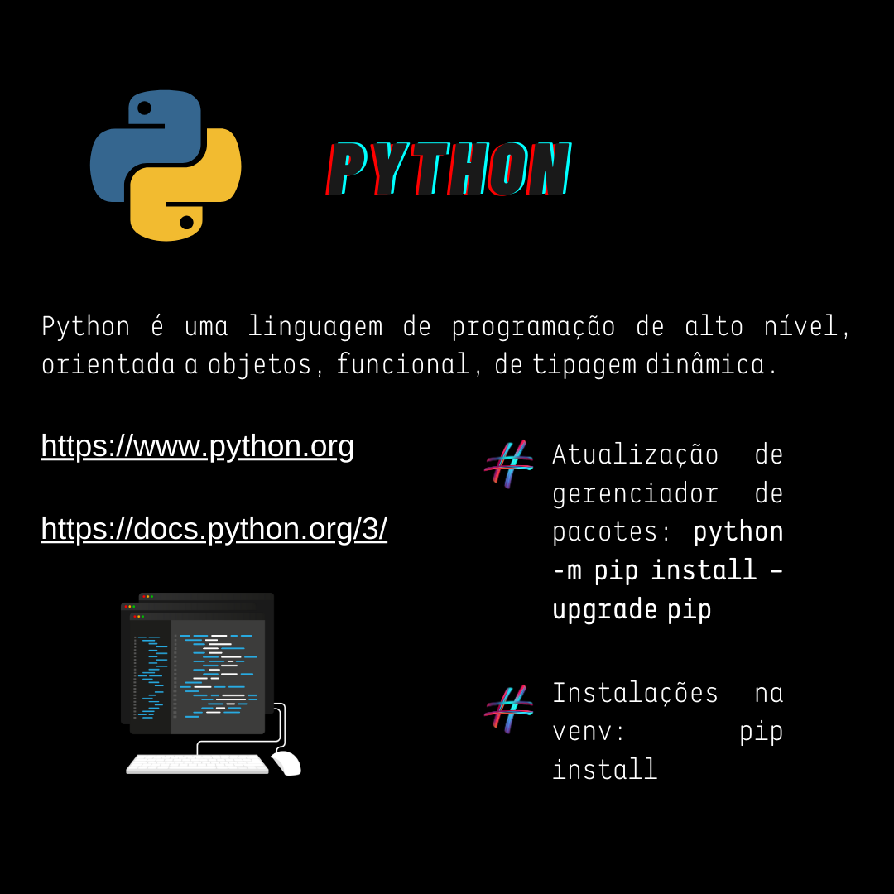
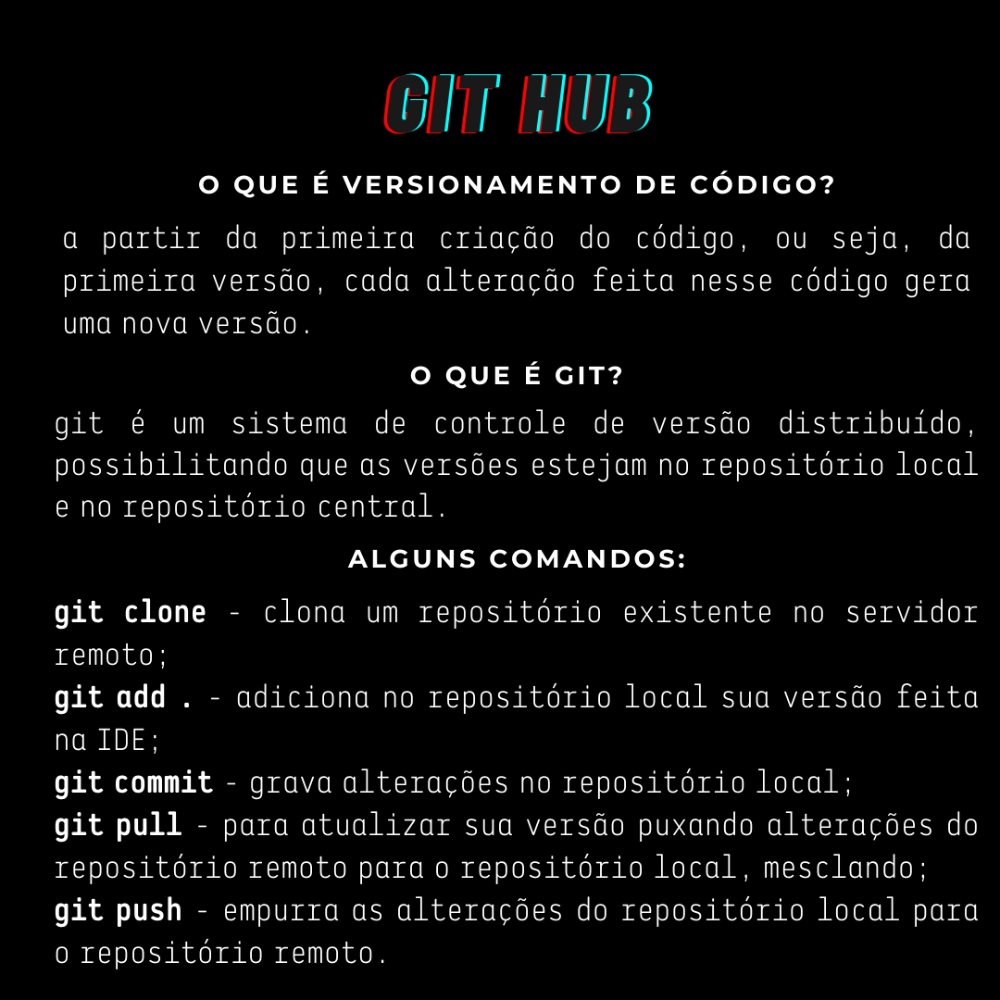

# Python_exercicios_UFF

###Este é um repositório de aprendizado, erros e acertos de meu aprendizado em Python.
###Em construção.

###Este é um lembrete sobre o funcionamento básico do git:

#Sobre o projeto:

###Na pasta Imagem guardei as imagens utilizadas no projeto;

###Na pasta env está reservado um ambiente seguro para instalações do projeto (ambiente virtual) utilizando o comando pip install;
###Se quiser ativar o ambiente virtual, vá ao terminal, entra na pasta do projeto e no ambiente .\venv\Scripts\Activate.ps1 (se estiver no PowerShell);
###Se quiser desativar o ambiente virtual, vá ao terminal e digite deactivate e exit.
